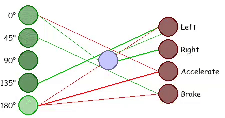
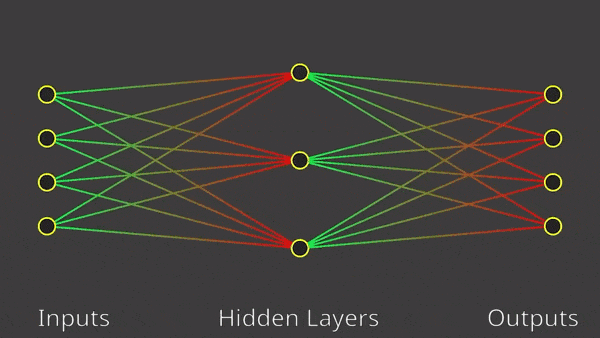
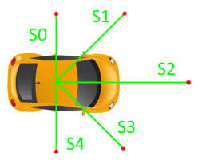
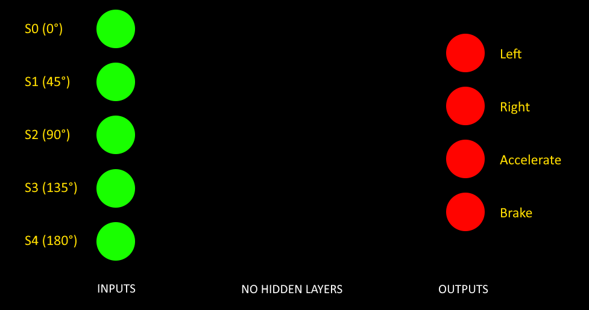

# Neat Cars

## 📝 Description

Neat cars allows you to draw a track, choose a starting point and watch the magic happen: the cars will drive themselves and constantly improve their driving skills.
<br>You will also be able to observe the Artificial Neural Network of the best car from the generation.

The project is based on a genetic algorithm called [NEAT (NeuroEvolution of Augmenting Topologies)](https://en.wikipedia.org/wiki/Neuroevolution_of_augmenting_topologies).

## 🎥 Demo

### Live neural network in the top left corner



### Track 1: With sensors - Infinite track

https://user-images.githubusercontent.com/52708150/223087114-7d4e0401-bb33-46fd-9673-bd973de7235f.mp4

### Track 2: Without sensors - Finite track

https://user-images.githubusercontent.com/52708150/223087098-0bd16d36-cef2-4773-b657-5471fa1f5baa.mp4

## 💡 How to use

### Prerequisites

* Python 3.7.0+

Get a copy of the Project. Assuming you have git installed, open your Terminal and enter:

```bash
git clone 'https://github.com/marcpinet/neat-cars.git'
```

To install all needed requirements run the following command in the project directory:

```bash
pip install -r requirements.txt
```

### Running

1. Open your terminal (PowerShell or Command Prompt).
2. Change your directory to where the project is located:
   ```bash
   cd C:\Users\nshwe\Downloads\CAR
   ```
3. Run the simulation:
   ```bash
   python main.py
   ```

### 🎮 Simulator Controls (Custom Pro Features)

We have built a fully interactive custom UI overlay into the simulator. Once you run `main.py`, you can use these controls to set up the race:

* **[L-Click]**: Draw your custom track (or place the Start Point)
* **[R-Click]**: Erase track (draw walls/grass)
* **[UP / DOWN Arrows]**: Rapidly change the size of your drawing brush
* **[SPACE]**: Lock in your track drawing and move to the Start phase

Once the track is drawn and the AI starts running, you have access to powerful hotkeys:
* **[F] Drop Finish Line**: Hover your mouse anywhere on the track and press `F` to drop the Red Bullseye Finish Line. The first car to touch it wins instantly!
* **[S] Save Best Car**: If no finish line is set, you can press `S` to manually stop training early and save the smartest car's brain to `best_car.pkl`.
* **[H] Hyper-Speed Mode**: Uncaps the Pygame framerate! This allows the AI generations to evolve and learn 10x faster so you don't have to wait.
* **[V] Toggle Lasers**: Hides or shows the blue laser sensors on the cars for a cleaner visual look.
* **[F5] Hard Restart**: Instantly wipes the track and restarts the program back to a blank canvas.

If a car wins or you press `S`, a Victory Screen will appear. Press **[P]** to watch a perfect playback of the winning car driving the track!

## ⚙️ How the AI works

The neural network is trained using the NEAT algorithm. The NEAT algorithm is a genetic algorithm which evolves over time from a basic neural network to a more advanced and complex one *depending on your fitness function* by going further and further. Check the [neat-python documentation](https://neat-python.readthedocs.io/en/latest/neat_overview.html) for more infos.



Also, you can find the full mathematic approach and details directly in the [NEAT paper](https://nn.cs.utexas.edu/downloads/papers/stanley.ec02.pdf).

### Inputs

The main informations the car will use to drive are the distance to the walls in front and next of it. The car has 5 sensors :

- In front,
- 2 in the diagonals
- 2 on each side

The sensors are represented by a green line in the rendering. Red means the sensor is detecting a wall.

[](https://marcpinet.me)

### Outputs

The outputs are obviously the car's actions. The car has 4 possible actions:

- Turn left
- Turn right
- Accelerate
- Brake

Note that we have a minimum speed to respect so that the car doesn't stop completely nor drives too slowly.

We get, as a starting point for our neural network, something like this:



The algorithm will then create itself the necessary connections (increasing their weight over time) and eventually add hidden layers in the process.

### Fitness

The fitness is quite simple: the more the car drives, the better it is. The fitness is calculated by the distance the car has driven. The car is therefore penalized if it crashes.

## 🐛 Known issues

* Nothing yet!

## 🥅 TO-DO List

* Find a way to allow 8-like tracks

## ✍️ Authors

* **Marc Pinet** - *Initial work* - [marcpinet](https://github.com/marcpinet)

## 📃 License

This project is licensed under the MIT License - see the [LICENSE.md](LICENSE.md) file for details
